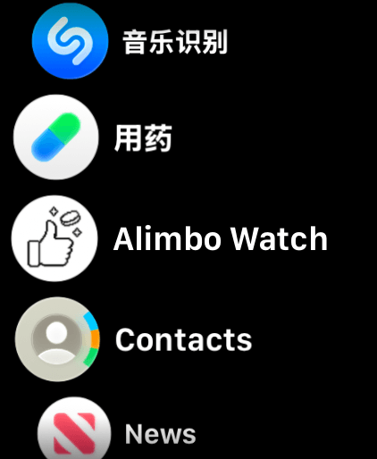
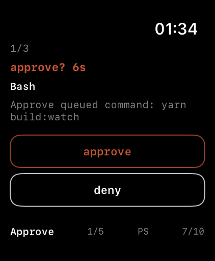
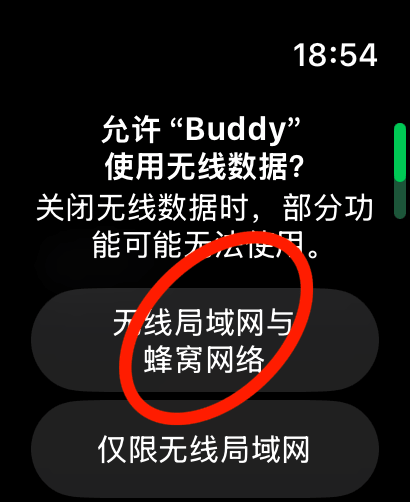
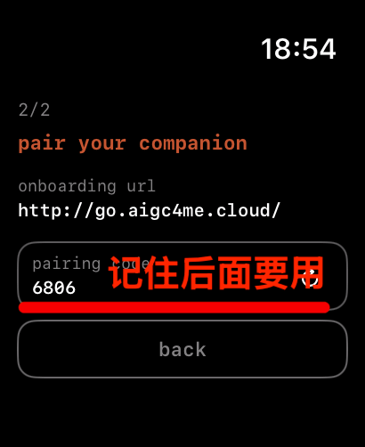
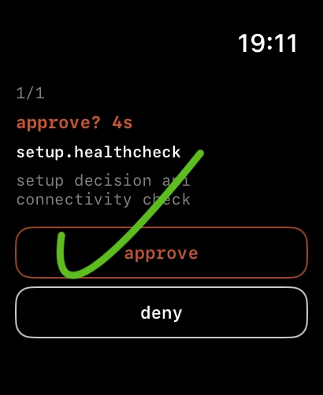
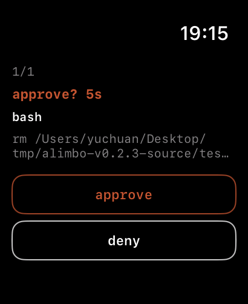

# 参与 Alimbo Watch 内测

## Alimbo Watch 是什么？

Alimbo Watch 是一款基于 Alimbo 的 watchOS 应用，安装在 Apple Watch 上，可以让你在手表上直接与智能体进行交互。

比如查看 Claude Code 的运行状态、消耗的 token 数，还是 approve 或 deny 它的任务，Alimbo Watch 都能帮你做到。





## Alimbo 是什么？

Alimbo 是一个安装在桌面设备的中转站，将本地 Agent 消息转发到你的移动设备上，和将你的消息从移动设备发回到本地 Agent。

这样你可以随时随地处理各种智能体消息，比如在手机飞书 App 上发提示词给 Copilot，在 Apple Watch 上审批 Claude Code 的文件操作...

---

## 前提

[ ] 你的 Apple Watch
[ ] 你的 iPhone 且安装有 TestFlight 应用
[ ] 你的电脑（Windows 或 macOS）安装有 Agent（如 Claude Code、Codex、Copilot 等等）

**如果你对 Alimbo Watch 感兴趣且满足以上前提，想要参与内测，请按照以下步骤操作：**

## 加入内测

群名：Alimbo Watch 内测交流群
群介绍：这是一个专门为 Alimbo Watch 内测用户准备的交流群，在这里你可以与其他内测用户交流使用心得，反馈问题，获取最新的内测信息和版本更新。
群公告：欢迎加入 Alimbo Watch 内测交流群！请在群里保持友好和尊重，积极分享你的使用体验和反馈。我们会定期在群里发布内测版本更新和相关信息。感谢你的参与和支持！

- 抖音群


- 小红书群


## 申请内测

- 提供基本信息：您的姓名和邮箱


- 成为 Alimbo Watch App 成员：苹果会根据您提供的信息，发送成员邀请邮件到您的邮箱，请注意查收并接受邀请。


- 获得 Alimbo Watch TestFlight 链接：接受邀请后，您将获得 Alimbo Watch 的 TestFlight 测试链接，点击链接即可下载并安装内测版本。


## 参与内测

### 1. 下载 TestFlight 应用

在您的 iPhone 上安装 TestFlight 应用（在 App Store 上也可以搜到），这是苹果官方的测试平台。


### 2. 安装 Alimbo Watch App

点击您收到的 TestFlight 链接，打开 TestFlight 应用，选择 Alimbo Watch 安装。它会同时在你的 iPhone 和 Apple Watch 上安装。

> 注意：打开 iPhone 版本 App 会是**空白**的这是因为 iPhone 版本是为了配合 Apple Watch 版本的安装和调试，因此 Alimbo Watch 功能只有 Apple Watch 才有。


#### Alimbo Watch App 没有安装到 Apple Watch 上？

如果你遇到 Alimbo Watch 只安装在 iPhone 上，没有安装到 Apple Watch 上请检查 TestFlight 应用中的 Alimbo Watch 设置，是否打开“在 Apple Watch 上显示 App”：


### 3. 使用 Alimbo Watch App

在你的 Apple Watch 上打开 Alimbo Watch App，首次安装会有1个网络连接授权和1个配对引导，全部通过后你会获得一份 SKILL 文档链接和一串配对码，用来帮助你连接 Alimbo 中转站。

- 网络连接授权：请允许 Alimbo Watch 连接到网络，以便与 Alimbo 中转站通信。



- 用户名：请输入您的用户名，用于在 Alimbo 中转站中识别您的身份。

> 点击下一步后仍然可以返回上一步重新更改用户名。不过一旦完成配对，后续便无法修改。

! [用户名输入截图](../assets/username-input.png)

- Alimbo 中转站 SKILL 文档链接：https://go.aigc4me.cloud
- 4位数的配对码（关键）



> 4位数的配对码有效期为30分钟，如果没有在30分钟内完成配对，可以点击“刷新按钮”重新生成新的配对码。

### 4. 将 Alimbo Watch App 与 Alimbo 中转站配对

让你的 Agent 访问 SKILL 文档链接，它会自动帮你在电脑上安装 Alimbo 中转站。然后引导你进入配对流程，输入刚刚获取的4个数字完成配对。

- 让 Agent 访问 https://go.aigc4me.cloud 这份 SKILL 文档链接，帮你自动安装 Alimbo。

这里以 Claude Code 为例，我在 `tmp` 目录（tmp 可以换成你自己的目录）下打开 Claude Code CLI。


输入提示词：`阅读 https://go.aigc4me.cloud 并帮我安装这个工具`，Claude Code 就会自己直到帮你下载并安装 Alimbo 中转站。


> 如果你是第一次在该目录下使用 Claude Code CLI，Claude Code 会不断要求你授权它使用各种指令，全部选择 `yes`。

下载完成后，Claude Code 会让你接管后续操作，运行 `setup` 安装程序进行配对。


退出 Claude Code CLI 后，按它给出的提示执行以下命令：

```bash
cd alimbo-v0.2.3-source
node dist/cli.js setup
```

进入配对流程，第一步让你输入一个 URL，这里不用输入，直接回车！


第二步让你输入4位数的配对码，输入你在 Apple Watch 上看到的4位数配对码（比如我的配对码是 6806），这步非常关键！


第三步会询问你是否需要连接飞书，如果你只想连接 Apple Watch，输入 `N`。

最后如果你的终端显示：

```
[alimbo-setup] Success
[alimbo-setup] Process info:
[alimbo-setup] - alimbo-gateway pid=...
[alimbo-setup] - alimbo-feishu pid=not-started
...
```


并且你的 Apple Watch 收到一条审批消息：“Setup intercept decision connectivity check”。



> 此时不管选择 approve 还是 deny 都可以。

恭喜你已经成功完成中转站与 Alimbo Watch 的配对！现在你可以在 Apple Watch 上使用 Alimbo Watch App 来审批你桌面上的 Agent 了。

### 5. 体验 Alimbo Watch 审批 Agent 的任务

重新在 `/alimbo-v0.2.3-source` 目录下打开 Claude Code CLI，输入提示词：帮我在当前目录创建一个空的 test.txt。


> 因为 Alimbo 初次安装默认只拦截了 Bash 这一个工具，而创建文件的操作一般不会触发 Bash，所以你不会在 Apple Watch 上看到审批消息。

当 Claude Code 创建完 test.txt 后，再输入提示词：删除 test.txt。


一般3秒内你会在 Apple Watch 上收到来自 Claude Code 删除 test.txt 的审批消息：



你可以选择 approve 或 deny 来允许或拒绝 Claude Code 删除文件的这个操作。

## 常见问题

如有碰到其他问题，你可以通过以下途径联系 Alimbo 开发者团队：

1. 内测群：加入上面提到的抖音群或小红书群，将问题丢到群里。
2. 邮件：发送邮件到 bluesgump@foxmail.com，我会第一时间回复你。
3. TestFlight：在 TestFlight 应用中找到 Alimbo Watch，点击“发送反馈”，描述你的问题并附上相关截图。
4. GitHub Issues：在 Alimbo 的 GitHub 仓库中[提交 Issues](https://github.com/ganyuchuan/alimbo/issues)。